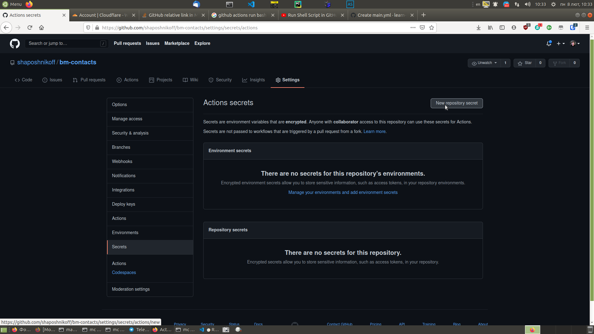
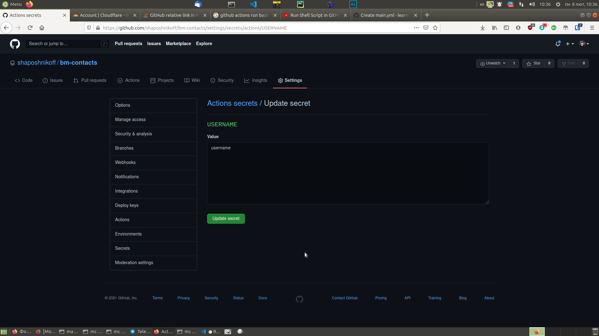
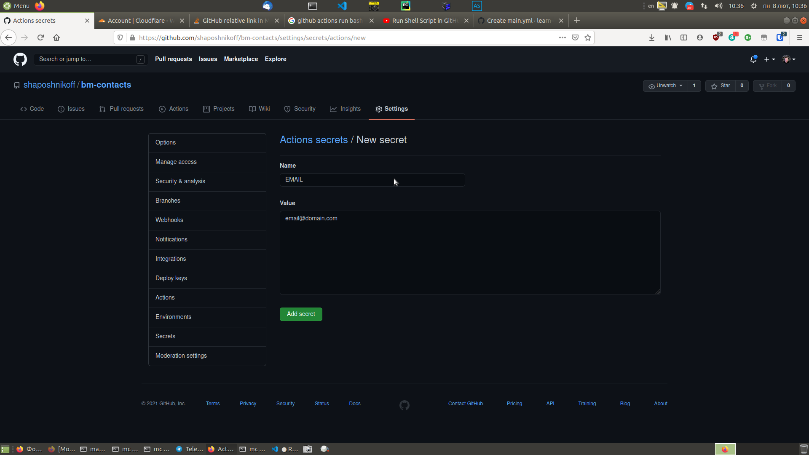
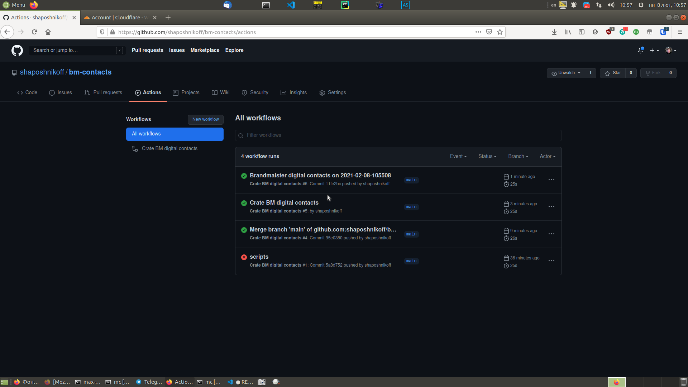

1. создаем репозиторий на Github. Имя может быть любое.


```
max@max-dacha git_repos $ git clone git@github.com:shaposhnikoff/bm-contacts.git
Cloning into 'bm-contacts'...
Warning: Permanently added 'github.com,140.82.121.4' (RSA) to the list of known hosts.
remote: Enumerating objects: 3, done.
remote: Counting objects: 100% (3/3), done.
remote: Compressing objects: 100% (2/2), done.
remote: Total 3 (delta 0), reused 0 (delta 0), pack-reused 0
Receiving objects: 100% (3/3), done.

```

Here's an image:


Move along.

2. клонируем его локально, для удобства

```
max@max-dacha git_repos $ git clone git@github.com:shaposhnikoff/bm-contacts.git
Cloning into 'bm-contacts'...
Warning: Permanently added 'github.com,140.82.121.4' (RSA) to the list of known hosts.
remote: Enumerating objects: 3, done.
remote: Counting objects: 100% (3/3), done.
remote: Compressing objects: 100% (2/2), done.
remote: Total 3 (delta 0), reused 0 (delta 0), pack-reused 0
Receiving objects: 100% (3/3), done.

```

Добавляем в репозиторий скрипт, который будет генерировать CSV файлы и логику Github Actions, которая будет периодически 
запускать скрипт, коммитить изменения в репозиторий и формировать index.html

[brandmeister-digital-contacts](./../brandmeister-digital-contacts.py)

Для того, чтобы Github Action script мог закоммитить сгенерированые файлы в репозиторий, необходимо указать две переменные 
окружения для git - это USERNAME и EMAIL. 

Эти переменные используются вот так

```
git config user.name ${{ secrets.USERNAME }}
git config user.email ${{ secrets.EMAIL }}
```

Заходим в настройки репозитория, settings/secrets/actions



нажимаем New Repository Secret и заполняем соответствующие поля. 





В данном случае, эти переменные используются в качестве 
исключительно информационном, никто не мешает заполнить их неправильно или некорректно,более того, необходимо чтобы 
конфигурационный файл .gitconfig выглядел следующим образом

```
[user]
	email = username@domain.com
	name = Username Lastname
```
Итак, мы заполнили необходимые поля - возвращаемся назад.

В большинстве случаев, Github Actions после этих настроек начинают работать, и мы можем видеть зеленый статус 
выполнения 

